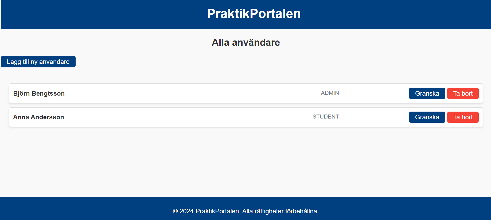

# PraktikPortalen

**PraktikPortalen** is an application developed as part of the course *DevOps*  for Java Developers at Nackademin. The project is an exercise in using Docker, deploying applications, and setting up continuous integration and continuous deployment (CI/CD) pipelines using GitHub Actions. 

Currently, the site is deployed on [Render.com](https://render.com), and you can access the homepage via this link: [https://myproject-6l4o.onrender.com/](https://myproject-6l4o.onrender.com/).

  

PraktikPortalen is a developing application aimed at streamlining the internship (LIA) process for students, course coordinators, and companies. The objective is to create a centralized hub where users can efficiently manage internship-related activities in the future.

## Features

### Current Features:
- **User Roles**: 
  - Users can add themselves to the system and update both their own and other users' roles. Currently, there are no user accounts, but future updates will restrict role management to administrators.

### Planned Features:
- **GitHub Authentication**: 
  - Future versions will support GitHub login for secure authentication and simplified access.

- **Application Management for Students**:
  - Students will be able to track the status of their internship applications with statuses such as:
    - "Applied"
    - "Awaiting Feedback"
    - "Interview Scheduled"
    - "Accepted"
  
- **Admin-Only Permissions**:
  - In future releases, only administrators will have the ability to update user roles to ensure proper security and management.

## How to Get Started

### Prerequisites:
To run PraktikPortalen locally, ensure you have the following installed:

- [Java 20](https://www.oracle.com/java/technologies/javase-jdk20-downloads.html) (or ensure your Java toolchain is configured to use Java 20)
- [PostgreSQL](https://www.postgresql.org/) (as the runtime database for your application)
- [Git](https://git-scm.com/) (to clone the project repository)

> **Note:** You don't need to install Gradle manually. The project uses the Gradle Wrapper (`gradlew`), so Gradle will be automatically downloaded and used when you build the project.
